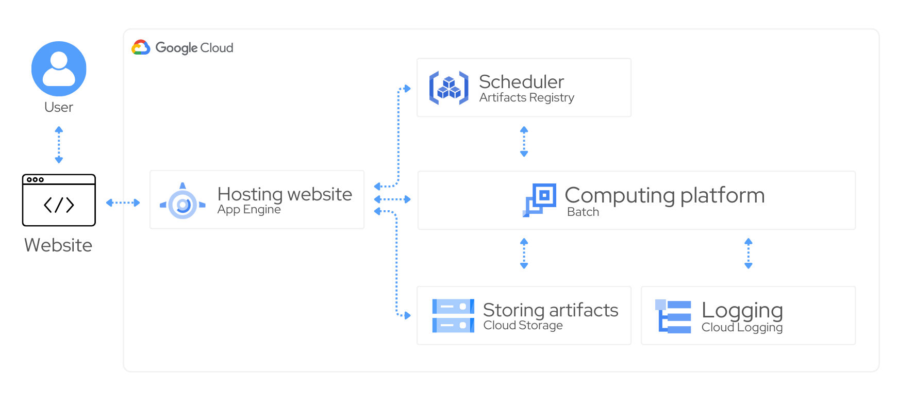

# Production Order Scheduler Generator

## Introduction
Generating and evaluating is a difficult task that usually requires an effort of a group of people. We're aiming to automate this process with state-of-the-art optimization techniques that would generate an optimal order scheduling plan taking into account user preferences and needs. Easily create, compare, and export multiple plans in an iterative process to get the best outcome you can get.

## Use cases
This solution allows you to:

- **Generate ad-hoc optimized production order schedule**. This solution allows you to define your own set of tasks and you can use our
solution to utilize the latest advances in the optimization domain to generate an optimal plan for orders in your company.

- **Run a different set of parameters in parallel**. You can easily test different sets of parameters and loss functions to get different types of plans and choose the best one for your purposes.

- **Compare generated schedules in an easy and user-friendly way**. We provide code to display and compare different plans on different types of charts (e.g. radar plot, Gantt plot, etc.)

- **Generate a report and export the plan**. Export the output as a comprehensive report and the solution as a `JSON` file.

## Architecture


## Set-up
Before going through the section make sure that you have [Google Cloud project created](https://developers.google.com/workspace/guides/create-project#google-cloud-console) and [billing enabled](https://cloud.google.com/billing/docs/how-to/modify-project).


#### Make the following changes in your GCP project:
- [ ] [Enable Batch API](https://console.cloud.google.com/apis/library/batch.googleapis.com)
- [ ] [Enable App Engine API](https://console.cloud.google.com/apis/api/compute.googleapis.com)
- [ ] [Create a bucket](https://cloud.google.com/storage/docs/creating-buckets) where artifacts will be stored. _Save the name for later._
- [ ] [Create an Arifacts Registry Docker repository](https://cloud.google.com/storage/docs/creating-buckets) where our app will store the solver code. _Save the name for later_.


#### Put the values in the config file
1. Clone this repository
1. Open `config.yaml` with a text editor
1. Make the following changes:
    ```yaml
    # Basic configuration
    project_id: "..."                   # Your GCP project ID
    region: "..."                       # Region
    bucket_name: "..."                  # Bucket name where the results will be stored
    artifacts_repository_name: "..."    # Artifacts repository name

    # Advanced configuration
    # (you can use the default values here)
    batch_machine_type: "e2-standard-2"   # Machine type that will be used for calculations
    web_username: "user"                  # User name that will used to log in
    web_password: "user"                  # Password that will be used to log in
    ```
1. Save changes.

#### Deployment
Now you're ready to deploy it!
```bash
gcloud app deploy

```
If everything goes as expected, you should get a link in the console that points to the
instance with our solution deployed (you can find in on [App Engine](https://console.cloud.google.com/appengine/services) page as well).

## Quotas
You can read more about default Batch quotas [here](https://cloud.google.com/batch/quotas). In our case, one scenario is allocated to a single VM.

## Technical notes
- The time needed to find a solution depends on a problem and the machine type (the more resources the better). To speed up computations you should consider using more powerful machine type (you can set it up in `config.yaml`)
- We're using library called [OR-Tools](https://developers.google.com/optimization) as optimization engine. Our solver is based on version `9.9.3963` of this library.

## Incidents management
There are two services that can raise some issues:
- **App Engine** which hosts the website and is responsible for changing state of other systems
- **Batch** that is responsible for running the optimize code for each scenario

## Security
By default, we're leveraging App Engine's default Service Account that has `Editor` role on the project ([read more here](https://cloud.google.com/appengine/docs/legacy/standard/python/service-account)).

## Data
All of your data is stored on Google Cloud Storage in `<your_bucket_name>/f33-solutions` dir. By default it can be accessed by out app via App Engine Service Account and people specified project IAM configuration.
